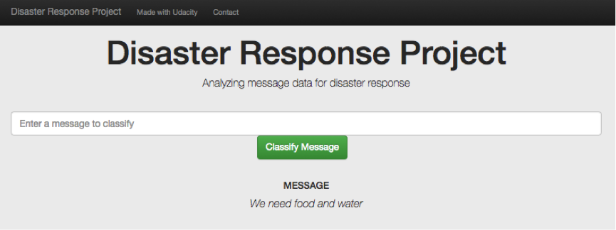

# Disaster Response Pipeline Project

This Project is part of Data Science Nanodegree Program by Udacity in collaboration with [Figure Eight](https://www.figure-eight.com).
The initial dataset provided by Figure Eight contain real messages sent during disaster events and their respective categories. 
The aim of the project is to build a Natural Language Processing tool that categorize messages.

The Project is divided in the following Sections:
  1. Data Processing, ETL Pipeline to extract data from source, clean data and save them in a proper databse structure
  2. Machine Learning Pipeline to train a model able to classify text message in categories
  3. Web App to show model results in real time. 

## Instructions - Executing Program:
1. Run the following commands in the project's root directory to set up your database and model.

    - To run ETL pipeline that cleans data and stores in database
        `python data/process_data.py data/disaster_messages.csv data/disaster_categories.csv data/DisasterResponse.db`
    - To run ML pipeline that trains classifier and saves
        `python models/train_classifier.py data/DisasterResponse.db models/classifier.pkl`

2. Run the following command in the app's directory to run your web app.
    `python run.py`

3. Go to http://0.0.0.0:3001/

## Dependencies
* Python 3.5+ (I used Python 3.7.4)
* Machine Learning Libraries: NumPy, Pandas, Sciki-Learn
* Natural Language Process Libraries: NLTK
* SQLlite Database Libraqries: SQLalchemy
* Web App and Data Visualization: Flask, Plotly

## Results

**Step 1: ETL Pipeline**
* Loaded the messages and categories datasets (`disaster_messages.csv`, `disaster_categories.csv`)
* Merged the two datasets
*	Cleaned the data 
*	Saved it in a SQLite database `DisasterResponse.db`
            
**Step 2: ML Pipeline**
* Loaded data from the SQLite database
*	Split the dataset into training and test sets
*	Built a text processing and ML pipeline using NLTK and scikit-learn's Pipeline 
*	Trained and tuned the model using GridSearchCV
*	Evaluated results on the test set
*	Exported the final model as a gzip pickle file `model.p.gz`
            
**Step 3: Python Scripts**
* Converted the jupyter notebooks into python scripts `process_data.py` and `train_classifier.py`
* Refactored the code to make it modular
            
**Step 4: Flask App**
* Uploaded sql database file and pkl file with the final model to a Flask app template
* Created data visualizations in the app using Plotly

## Screendhots

  1. The main page shows some graphs about training dataset, provided by Figure Eight!
  [Main Page](screenshots/main_screen.png)
  2. This is an example of a message you can type to test Machine Learning model performance
  3. After clicking **Classify Message**, you can see the categories which the message belongs to highlighted in green!
  [Sample Output](screenshots/result.png)

## Authors

* Vasilis Kontonis
 - [LinkedIn](https://www.linkedin.com/in/vasilis-kontonis-baa281b4/)
 - [GitHub](https://github.com/bkontonis)

## License

## Acknowledgements
* This project is part of [Udacity Data Science Nanodegree Program](https://www.udacity.com/course/data-scientist-nanodegree--nd025).
* [Figure Eight](https://www.figure-eight.com/) for providing messages dataset to train my model

